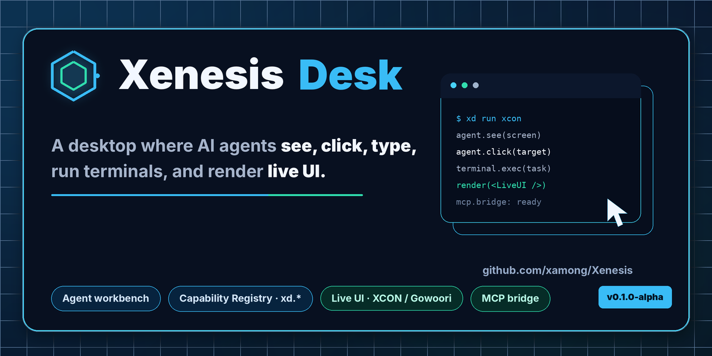
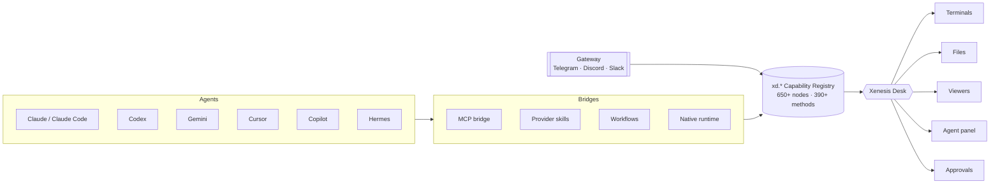

<div align="center">

<picture>
  <source media="(prefers-color-scheme: dark)" srcset="./.github/social-preview.png">
  
</picture>

<h1>Xenesis Desk</h1>

<p><strong>A desktop where AI agents can see, click, type, run terminals, and render live UI while they work.</strong></p>

<p><sub>ONE DESK, DRIVEN BY</sub></p>
<p>
  <b>Claude</b> &nbsp;·&nbsp; <b>Codex</b> &nbsp;·&nbsp; <b>Gemini</b> &nbsp;·&nbsp; <b>Cursor</b> &nbsp;·&nbsp; <b>Copilot</b> &nbsp;·&nbsp; <b>Hermes</b>
</p>

<p>
  <a href="https://github.com/xamong/Xenesis"><b>🛰️ Repo</b></a> &nbsp;·&nbsp;
  <a href="docs/manual/README.md"><b>📖 Manual</b></a> &nbsp;·&nbsp;
  <a href="#-capability-registry"><b>🗂️ Capability Registry</b></a> &nbsp;·&nbsp;
  <a href="https://github.com/xamong/Xenesis/discussions"><b>💬 Discussions</b></a> &nbsp;·&nbsp;
  <a href="https://github.com/xamong/Xenesis/issues/new/choose"><b>🐛 Issues</b></a>
</p>

<p>🌐 <b>English</b> | <a href="README.ko.md">한국어</a></p>

<p>
  <a href="LICENSE"></a>
  <a href="https://github.com/xamong/Xenesis/releases"></a>
  
</p>

<p>
  
  
  
  <a href="#-capability-registry"></a>
  <a href="CONTRIBUTING.md"></a>
</p>

</div>

---

Most agent products stop at chat. **Xenesis Desk gives agents a workbench** — a 5-zone desktop with terminals, files, viewers, panels, approvals, MCP tools, and live UI rendering. Claude, Codex, Gemini, Cursor, Copilot, Hermes, and other agents all control the **same Desk** through one **Capability Registry**.

When an agent answers, it doesn't have to send only text. Through **Gowoori** and **XCON**, the answer can become a live chart, table, map, network diagram, dashboard, or workflow surface — streamed directly inside the conversation as tokens arrive.

## ✨ Features

- **🖥️ Agent workbench, not a prompt box**
  - Agents get terminals (`@xterm` + node-pty / ConPTY), a file workspace (CodeMirror 6), viewers, docking panes, and full app control across a 5-zone desktop.
- **🔌 One shared control plane**
  - MCP tools, provider skills, workflows, and the native runtime all call the same `xd.*` **Capability Registry** — 650+ nodes, 390+ methods. Claude, Codex, Gemini, Cursor, Copilot, and Hermes drive the *same* Desk.
- **📊 UI as the answer**
  - LLM output renders as live **XCON / Gowoori** UI — charts, tables, maps, network diagrams, dashboards — streaming as tokens arrive, not just Markdown text or static screenshots.
- **📱 Remote CLI control with safety gates**
  - Watch and steer Codex / Claude Code from your phone through a gateway with Telegram, Discord, and Slack channels and approval gates.
- **🧩 Dashboards on demand**
  - XCON fixtures, chains, sketches, and workflow actions keep generated dashboards alive and data-bound as the underlying data changes.

## ⚔️ Xenesis Desk vs a plain chat agent

| Capability | Plain chat agent | **Xenesis Desk** |
|---|:---:|:---:|
| Send text replies | ✅ | ✅ |
| Run real terminals (PTY) | ❌ | **✅ `@xterm` + node-pty / ConPTY** |
| Read & edit a file workspace | ⚠️ via tool | **✅ native CodeMirror panes** |
| Click / type / drive the app UI | ❌ | **✅ full Desk control** |
| Render the answer as live UI | ❌ text only | **✅ XCON / Gowoori charts, tables, maps, dashboards** |
| One control plane for many agents | ❌ | **✅ shared `xd.*` Capability Registry** |
| Operate a CLI agent from your phone | ❌ | **✅ gateway + Telegram / Discord / Slack + safety gates** |
| First-class MCP tool bridge | ⚠️ varies | **✅ bundled MCP server + HTTP bridge** |
| Data-bound dashboards that stay live | ❌ | **✅ XCON fixtures / chains / workflows** |

> [!NOTE]
> Xenesis Desk is **early alpha**. The workbench, Capability Registry, MCP bridge, and live UI rendering work today; the public API, packaging, and some provider installers are still moving.

## 🧠 How it works

Every agent — native, MCP, provider skill, or workflow — calls the **same** `xd.*` Capability Registry. That shared surface is why so many different agents can control one Desk.



## 🚀 Quick start

Xenesis Desk is an **early-alpha** desktop app. There is no published installer yet — run the development shell:

```bash
git clone https://github.com/xamong/Xenesis.git
cd Xenesis
npm install
npm run dev        # launches the Electron desktop shell
```

The `dev` script handles `npm install`, internal SQLite server setup, native module rebuild, and `electron-vite` dev.

Then, inside the app:

1. Open **Settings › AI Provider** and install a local MCP/Skill profile for a CLI agent.
2. Ask an agent to inspect Desk state through the **MCP bridge** or the `/xd` skill.
3. Generate a **Gowoori / XCON** dashboard from Markdown and watch it render as live UI.
4. Optionally enable a **gateway channel** (Telegram / Discord / Slack) to drive a CLI agent remotely.

> [!WARNING]
> Remote CLI control executes commands on your machine. Keep **approval gates** enabled when exposing a Desk over a gateway channel.

---

## Key Ideas

### AI agent with a workbench

Xenesis is not a tool for humans — it is an AI agent that owns a workbench. Terminals, file explorers, viewers, and panels are tools the agent uses to get work done.

### Workbench shared with other agents

Any external AI agent can control the same Desk through the Capability Registry (650+ public nodes and 390+ callable methods at the current alpha scale). Connect via MCP, HTTP bridge, or provider skills — Claude, Codex, Gemini, Cursor, Copilot, Hermes, and others all speak the same protocol.

### AI responds with UI, not just text

Gowoori turns LLM output into real rendered UI. The AI writes Markdown with `xcon-sketch` fences, and the viewer renders charts, tables, maps, and dashboards — streaming in real time as tokens arrive, even before the response is complete.

### Data-binding UI automation

XCON separates concerns into four layers:

| Layer | Fence | Role |
|---|---|---|
| **Fixture** | `` ```xcon-chain-fixture `` | Source data (JSON) |
| **Chain** | `` ```xcon-chain as alias `` | Data transformation (SUGAR expressions) |
| **Sketch** | `` ```xcon-sketch `` | UI layout (`$alias` references) |
| **Workflow** | `` ```xcon-workflow `` | Automation actions |

Change the fixture, and the UI updates automatically. The AI designs the dashboard once; Desk keeps it alive.

### Remote CLI control

The Xenesis Gateway + terminal stream filters let you operate Codex or Claude Code from a phone. Stream filters strip CLI chrome (progress spinners, tool calls, internal lines) and extract only the meaningful narrative. A safety layer blocks dangerous commands; an LLM engine auto-responds to safe prompts.

### Dashboards generated on demand

No pre-built dashboards. When a situation arises, the AI generates a dashboard tailored to that exact context — in a NOC, a meeting room, a classroom, or a one-person startup. The dashboard is not an asset; it is the agent's response.

---

<a id="capability-registry"></a>

## 🗂️ Capability Registry

Every controllable feature in Xenesis Desk is exposed through a stable tree path like `xd.terminals.run`, `xd.files.open`, or `xd.capture.pane`. The registry is the shared contract used by the MCP bridge, agent tools, workflow runner, approval UI, CLI shortcuts, and external agents.

```ts
// Describe a capability
await deskBridge.describe('xd.terminals.run');

// Call a capability
await deskBridge.call('xd.terminals.run', {
  command: 'npm test',
  shell: 'powershell'
}, { approved: true });

// Query capabilities
await deskBridge.query({ kind: 'method', permission: 'read' });
```

<details>
<summary><b>Full <code>xd.*</code> top-level namespaces (click to expand)</b></summary>

<br/>

`xd.app` · `xd.workspace` · `xd.window` · `xd.dock` · `xd.terminals` · `xd.files` · `xd.fs` · `xd.remoteFiles` · `xd.extensions` · `xd.settings` · `xd.capture` · `xd.diagnostics` · `xd.mcp` · `xd.gowoori` · `xd.xenesis` · `xd.services` · `xd.automation` · `xd.artifacts` · `xd.playwright` · `xd.xcon` · `xd.audit` · `xd.control` · `xd.meta`

Each namespace exposes describe/query/call methods with per-permission gating (`read`, `write`, `control`, `execute`, `danger`).

</details>

## 🤝 Agents & channels

All providers and channels control the same Desk through the same Capability Registry.

| Agent / channel | Type | Drives the Desk via |
|---|---|---|
| Claude / Claude Code | CLI + provider | MCP bridge · `/xd` skill |
| Codex | CLI | gateway · MCP |
| Gemini | provider | provider skill |
| Cursor | editor agent | MCP |
| GitHub Copilot | provider | provider skill |
| Kimi · OpenCode · Pi · Qoder · Qwen · Devin | CLI | generated `/xd` skill files |
| Hermes | bot / provider surface | Python plug-ins (`xenesis_desk_gateway` + `xenesis_desk_bot`) |
| Telegram / Discord / Slack | remote channels | gateway + safety gates |

Installed public builds do not ship the full `providers/` development tree. **Settings › AI Provider** installs only the curated runtime assets under `provider-assets/**`: the Hermes Plug-in pair and the shared Xenesis Desk MCP/Skill template for local CLI clients.

## 🔌 MCP Integration

The bundled MCP server exposes the Desk control tools to external AI agents:

```json
{
  "mcpServers": {
    "xenesis-desk": {
      "command": "node",
      "args": ["path/to/mcp/xenesis-desk-mcp-server.mjs"]
    }
  }
}
```

Tools include `xenesis_desk_state`, `xenesis_desk_terminal_run`, `xenesis_desk_call_capability`, `xenesis_desk_playwright_snapshot`, `xenesis_desk_create_xcon_markdown`, and more. The server also exposes XCON generation prompts as MCP resources and prompt templates.

## 📊 XCON Viewer Integration

Any LLM provider can render UI in its chat by connecting `@xcon-viewer/core` and `@xcon-viewer/viewer`:

```js
import { parseBySyntax } from '@xcon-viewer/core';
import { render, viewerCss } from '@xcon-viewer/viewer';
```

When the Markdown renderer encounters an `xcon-sketch` fence, render it as a live UI component instead of a code block. Streaming rendering is supported — the UI builds progressively as tokens arrive.

## 📱 Terminal Automation

The automation engine monitors terminal output streams and provides intelligent auto-response:

- **Stream filters** for Codex, Claude Code, and Gemini strip internal progress lines and extract meaningful narrative.
- **Safety layer** blocks dangerous patterns (`rm -rf`, `drop database`, credential access).
- **LLM engine** auto-responds to safe prompts (y/n confirmations, option selection).
- **Regex and state-machine engines** for rule-based automation.

Combined with the Xenesis Gateway and channel adapters, this enables mobile-quality remote control of CLI agents. External channels only receive terminal stream data after a channel explicitly runs `/desk watch`; unfiltered stream mode is kept local/e2e-only to avoid noisy or unsafe outbound bot traffic.

## ⚙️ Settings Surfaces

Xenesis Desk separates native Desk agent settings from external provider settings:

- **Settings › Xenesis Agent** — native Xenesis Agent runtime, managed gateway, external bot channels, and Gowoori agent tool settings.
- **Settings › AI Provider** — Hermes Plug-in installer, Local CLI MCP and Skill installer, and BYOK provider profiles.

## 🧱 Extensions

Extensions use a two-layer architecture:

- **Main process** — `plugin.json` manifest + `main.js` with `exports.activate(api)` for command registration.
- **Renderer process** — `renderer.tsx` implementing `RendererExtensionContribution` for React panel UI.

| Extension | Panels |
|---|---|
| `xenesis-desk.core-tools` | Xenesis Agent, Xenesis Bot, AI Workbench, Artifact Library, Terminal Inspector, Process Viewer, Remote Sync Planner, Safe File Edit Center, Run Task Panel, Capability Explorer, Hermes panels, Activity Timeline, Network Monitor, Audit Log, Agent Performance, XApp Preview |
| `xenesis-desk.data-tools` | Meta Management, Query Analyzer, SQLite Server Settings |
| `xenesis-desk.workflow-runner` | Workflow Runner, Demo Lab Player/Maker, Gowoori, GowooriChat, Alert Rules, Template Catalog, Artifact Versions |

Sample extensions (`sample.*`) demonstrate the extension API for third-party developers.

## 🧰 Tech Stack

| Layer | Technology |
|---|---|
| App shell | Electron 41 |
| UI | React 19 + Vite 7 + electron-vite 5 + TypeScript 5.9 |
| Terminal | @xterm/xterm 6 + @lydell/node-pty (ConPTY) |
| Code editor | CodeMirror 6 (react-codemirror) |
| Grid | SpanGrid (Canvas-based high-performance grid) |
| XCON rendering | @xcon-viewer/core + @xcon-viewer/viewer |
| Agent runtime | Xenesis (`packages/xenesis`) — providers, tools, workflows, sessions, channels |
| MCP | @modelcontextprotocol/sdk (stdio server + HTTP bridge) |
| Internal server | Node.js + Express + better-sqlite3 |
| Packaging | electron-builder 26 (NSIS + portable) |

<details>
<summary><b>📁 Project structure (click to expand)</b></summary>

```
xenesis-desk/
├── src/
│   ├── main/                        Electron main process
│   │   ├── index.ts                 PTY, IPC, MCP bridge, services
│   │   └── automation/              Terminal automation engine
│   │       ├── automationController.ts  Stream monitor + auto-input
│   │       ├── streamFilters/       CLI-specific filters (codex, claude, gemini)
│   │       ├── llmEngine.ts         LLM-based safe auto-response
│   │       └── safety.ts            Dangerous command detection
│   ├── preload/                     Electron contextBridge
│   ├── shared/
│   │   ├── types.ts                 Shared IPC types
│   │   └── deskBridgeCapabilities.ts  Capability Registry (650+ public nodes)
│   └── renderer/
│       ├── App.tsx                  Root component
│       ├── dock/                    5-zone docking engine
│       ├── terminal/                xterm host + command store
│       ├── markdown/                Streaming XCON Markdown renderer
│       ├── panes/                   Built-in panes (16 types)
│       └── extensions/
│           ├── xenesis-desk.core-tools/    AI chat, Xenesis Agent, Bot,
│           │                               Capability Explorer, Hermes panels
│           ├── xenesis-desk.data-tools/    Meta management, Query analyzer
│           └── xenesis-desk.workflow-runner/
│               ├── panes/           Workflow Runner, Demo Lab
│               └── gowoori/         AI-to-UI pipeline
│                   ├── agent/       Intent router, prompt packs,
│                   │                artifact pipeline, validation,
│                   │                auto-repair, acceptance gate
│                   ├── chat/        GowooriChat UI
│                   └── viewer/      Artifact preview + global overlay
├── packages/
│   ├── xenesis/                     Xenesis agent runtime
│   │   └── src/
│   │       ├── core/                AgentRunner (turn loop), pipeline, events
│   │       ├── providers/           LLM providers (OpenAI, Anthropic, CLI, mock)
│   │       ├── tools/               50+ agent tools (file, shell, browser,
│   │       │                        desk bridge, search, diagnostics...)
│   │       ├── channels/            Telegram, Discord, Slack, webhook adapters
│   │       ├── gateway/             HTTP gateway server + dashboard
│   │       ├── orchestration/       Task scheduler, worker, agent tasks
│   │       ├── workflows/           Workflow engine + policy
│   │       ├── extensions/          Memory, subagents, skills, plugins, MCP
│   │       ├── sessions/            JSONL session recording
│   │       └── evaluation/          Capability eval + feedback loop
│   └── xenesis-agent-core/          Embedded runtime bridge for Desk
├── extensions/                      Sample extension manifests (plugin.json + main.js)
├── mcp/
│   ├── xenesis-desk-mcp-server.mjs  MCP stdio server
│   ├── xenesis-desk-file-safety.mjs Safe file write (preview/apply/restore)
│   ├── playwright-worker.mjs        Playwright screenshot/action worker
│   └── prompts/                     XCON generation prompt packs
├── providers/                       Provider integration assets
│   ├── shared/skills/xd/            /xd skill template (source of truth)
│   ├── claude/codex/cursor/...      Generated skill files (11 CLI agents)
│   └── hermes/plugins/              Hermes plug-ins + Xenesis gateway simulator
├── server/                          Built-in SQLite API server
└── scripts/                         Dev, build, release, and registry helper scripts
```

</details>

## 🛠️ Build

```bash
npm run build                  # typecheck + production build
npm run pack:win               # Windows unpacked build
npm run dist:win               # Windows installer (NSIS + portable)
npm run dist:mac               # macOS build (dmg + zip)
npm run check:public-release   # public source boundary check
```

### Requirements

| Item | Requirement |
|---|---|
| OS | Windows 10 1809+ / Windows 11 / macOS / Linux |
| Node.js | 22.12 or later |
| npm | 10 or later |
| C++ build tools | Required for `better-sqlite3` (Visual Studio Build Tools 2022 on Windows) |

## 🔒 Security

- Renderer runs in sandbox (`nodeIntegration: false`, `contextIsolation: true`, `sandbox: true`).
- All IPC goes through `contextBridge` with validated payloads.
- Capability calls from external sources require approval for `control`, `write`, `execute`, and `danger` operations.
- Terminal automation blocks dangerous commands before auto-input.
- AI API keys and bot tokens are stored locally through the settings / Secret Vault flow or referenced by environment variable names; secret values are never written into profiles.
- Content-Security-Policy: `script-src 'self'`.

See [SECURITY.md](SECURITY.md) to report a vulnerability.

## 🗺️ Roadmap

- [x] 5-zone docking workbench with terminals, files, viewers, panels
- [x] `xd.*` Capability Registry (650+ nodes, 390+ methods)
- [x] Bundled MCP server + HTTP bridge
- [x] Gowoori / XCON streaming UI rendering
- [x] Provider skills for 11 CLI agents + Hermes plug-ins
- [x] Gateway + Telegram / Discord / Slack channels with approval gates
- [x] Embedded codex agent with reasoning-effort control
- [ ] Published platform installers (Windows / macOS / Linux)
- [ ] Expanded data-bound dashboard workflow library
- [ ] Broader provider + channel coverage
- [ ] Public API & packaging stabilization

## 📚 Documentation

The full user manual lives in [`docs/manual/`](docs/manual/README.md):

| Chapter | Topic |
|---|---|
| [01 · Workbench & docking](docs/manual/01-workbench-docking.md) | The 5-zone desktop, panes, and layout |
| [02 · Terminal command center](docs/manual/02-terminal-command-center.md) | Terminals, command store, automation |
| [03 · Xenesis Agent](docs/manual/03-xenesis-agent.md) | The native agent runtime |
| [04 · Gowoori & artifacts](docs/manual/04-gowoori-artifacts.md) | AI-to-UI rendering and XCON artifacts |
| [05 · CR, MCP, gateway & bots](docs/manual/05-cr-mcp-gateway-bots.md) | Capability Registry, MCP bridge, channels |
| [06 · Files, workspace & settings](docs/manual/06-files-workspace-settings.md) | Files, workspace, and configuration |
| [07 · Extensions & workflow ops](docs/manual/07-extensions-workflow-ops.md) | Extension model and workflow runner |
| [08 · Troubleshooting & agent routing](docs/manual/08-troubleshooting-agent-routing.md) | Diagnostics, routing, and recovery |

## 🙌 Community & Contributing

Xenesis Desk is early alpha and we are looking for active community participation: try it, break it, open issues, propose demos, improve docs, add provider integrations, and help shape the agent workbench model. **Pull requests are welcome** — especially small, focused PRs with clear reproduction steps or release-check coverage.

- 📖 Contributing guide — [CONTRIBUTING.md](CONTRIBUTING.md)
- 🔒 Security policy — [SECURITY.md](SECURITY.md)
- 💬 Support routes — [SUPPORT.md](SUPPORT.md)
- 🤝 Code of conduct — [CODE_OF_CONDUCT.md](CODE_OF_CONDUCT.md)
- 📝 Changelog — [CHANGELOG.md](CHANGELOG.md)
- 🐛 Issues — <https://github.com/xamong/Xenesis/issues>
- 🗨️ Discussions — <https://github.com/xamong/Xenesis/discussions>

<a href="https://github.com/xamong/Xenesis/graphs/contributors">
  
</a>

## ⚖️ License

[MIT](LICENSE) © Xamong

<div align="center">
<br/>
<sub>If Xenesis Desk is useful to you, a ⭐ helps others find it.</sub>
</div>
